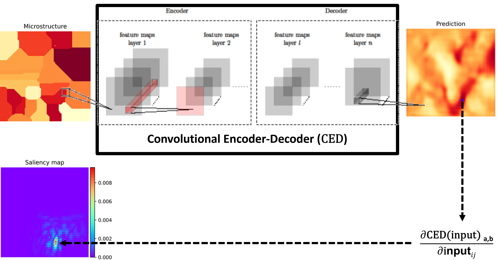

<p align="left">
  <a href="https://opensource.org/licenses/MIT">
    
  </a>
  
  
  
  <a href="https://github.com/ashriva16/Peak_Stress_in_Microstructures/issues">
    
  </a>
  <a href="https://github.com/ashriva16/Peak_Stress_in_Microstructures/pulls">
    
  </a>
</p>

# Deep Learning for Peak-Stress Prediction in Polycrystalline Materials

## 📌 Project Description
This project presents a deep learning approach to predict peak-stress clusters in heterogeneous polycrystalline materials. Unlike prior work that focused on overall stress fields, this method targets localized peak-stress regions critical to failure. Using a convolutional encoder–decoder network trained on synthetic microstructures and linear elasticity simulations, the model predicts stress fields and identifies peak-stress clusters. Evaluation using cosine similarity and geometric comparisons shows high accuracy, especially for higher normalized stress values.



### ✅ Key Features

- Rapid identification of optimal deposition parameters
- Improved consistency and reproducibility of thin film properties
- Reduced experimental effort

Our results confirm that Bayesian optimization is a powerful tool for thin film process development, delivering high-performance films with controlled stress and resistance characteristics.

---

## 🧱 Project Structure

```text
.
├── LICENSE             # Licensing information (e.g., MIT, Apache 2.0)
├── README.md           # Project overview, usage, setup, and contribution guidelines
├── requirement.txt
├── train.py           # main file
├── data_loader/        # Scripts for loading and preprocessing data
├── models/             # Model architecture definitions and related code
├── trainer/            # Training loops and experiment execution logic
├── utils/              # Shared utility functions and helper modules
```

---

Badge (once setup):

```markdown
[](https://github.com/ashriva16/Peak_Stress_in_Microstructures/actions)
```

---

## 👤 Maintainer

**Ankit Shrivastava**
Feel free to open an issue or discussion for support.

---

## 📜 License

This project is licensed under the [MIT License](https://opensource.org/licenses/MIT). See the `LICENSE` file for full details.

---

## 📈 Project Status

> Status: ✅ Ready for Use — Not Actively Maintained
---

## 📘 References

- [Cookiecutter Docs](https://cookiecutter.readthedocs.io)
- [PEP 621](https://peps.python.org/pep-0621/)
- [GitHub Actions](https://docs.github.com/en/actions)
